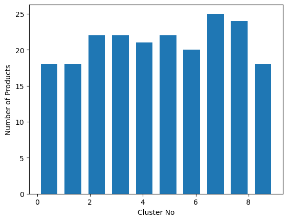

# Food Recommendation System

A machine learning project for grocery and food product recommendations, combining multiple recommendation strategies and synthetic data generation workflows.

## Highlights

- Multiple recommendation approaches in one project: Clustering, DQN, NCF, and xDeepFM
- End-to-end workflow from synthetic data creation to model experimentation
- Reusable trained model artifacts (`.pkl`) and supporting documentation

## Approaches Implemented

- **Clustering-based recommendation**: Groups users/items and recommends based on cluster behavior.
- **Deep Q-Network (DQN)**: Reinforcement-learning-style recommendation optimization.
- **Neural Collaborative Filtering (NCF)**: Learns user-item interactions with neural networks.
- **xDeepFM**: Captures both low- and high-order feature interactions.

## Repository Structure

- `Models/` - Model notebooks, trained model files (`.pkl`), and core grocery datasets
- `Synthetic Dataset/` - Notebooks and generated synthetic datasets
- `Minutes/` - Team meeting minutes (PDF)
- `Main Report.pdf` - Full technical report
- `User Manual.docx` - Usage documentation
- `docs/images/` - README screenshots and visual outputs

## Results

The repository currently provides notebook-based experimental outputs. A directly visible metric trend from the committed notebooks:

- **DQN notebook (`Models/DQN (1).ipynb`)**
  - Validation loss over 10 epochs improved from **11.1647** (Epoch 1) to **11.1441** (Epoch 10).

This indicates incremental training improvement in the tracked validation objective for that run.

## Screenshots

### Clustering Notebook Output



You can add more visuals by exporting plots from notebooks to `docs/images/` and linking them here.

## Quick Start

1. Install Python 3.8+.
2. Create and activate a virtual environment.
3. Install core dependencies used by notebooks:
   - `pandas`
   - `numpy`
   - `scikit-learn`
   - `matplotlib`
   - `jupyter`
   - `tensorflow` (for deep learning notebooks)
4. Launch Jupyter:

```bash
jupyter notebook
```

5. Run notebooks from:
   - `Models/`
   - `Synthetic Dataset/`

## Key Notebooks

- `Models/clustering_based_recommendation.ipynb`
- `Models/DQN (1).ipynb`
- `Models/neural_collaboritve_filtering_new.ipynb`
- `Models/xdeepfm_new.ipynb`
- `Synthetic Dataset/SyntheticData.ipynb`
- `Synthetic Dataset/synthetic_data_generator_intial.ipynb`

## Notes

- If a notebook uses machine-specific file paths, update them before running.
- Some model artifacts are already included for reuse (`*.pkl`).
- For complete methodology and discussion, refer to `Main Report.pdf`.

## Authors

Group18 (CE903)
